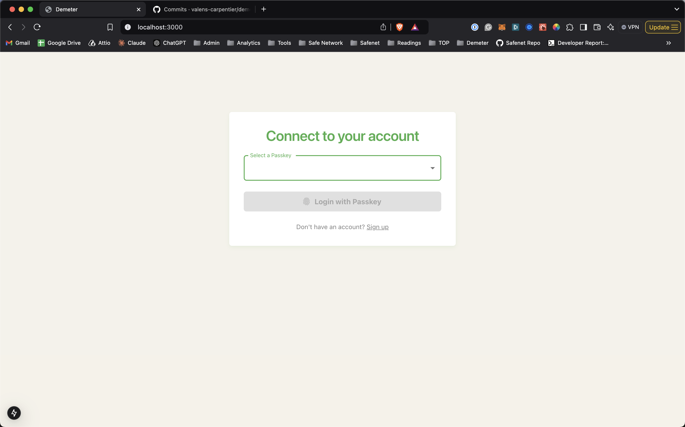
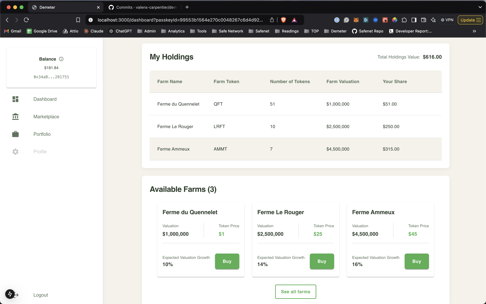
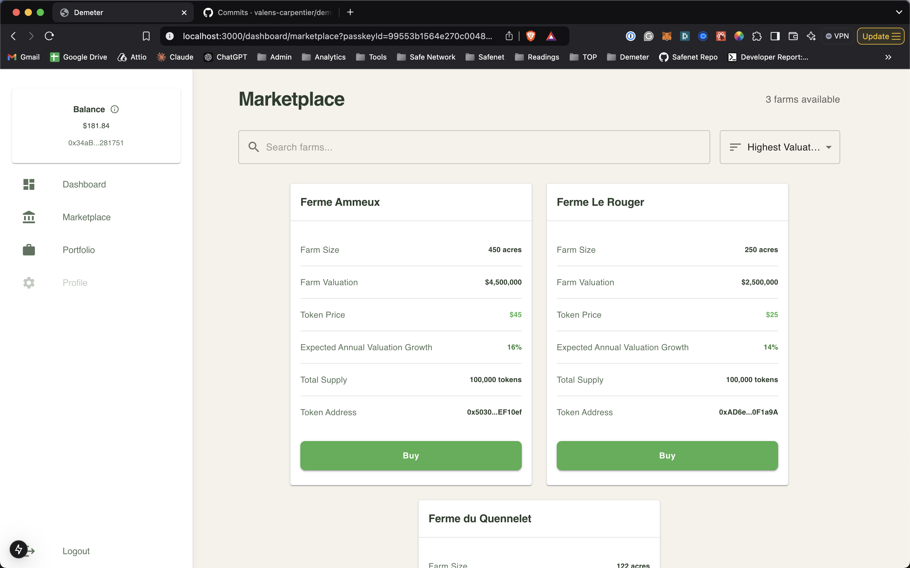
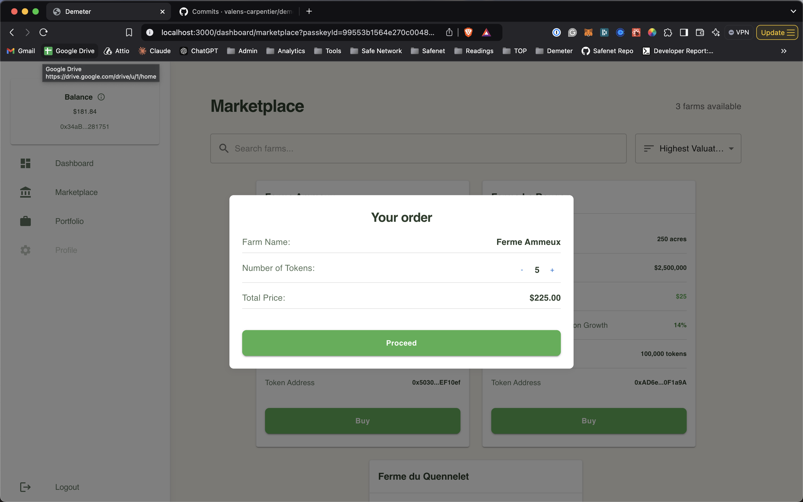
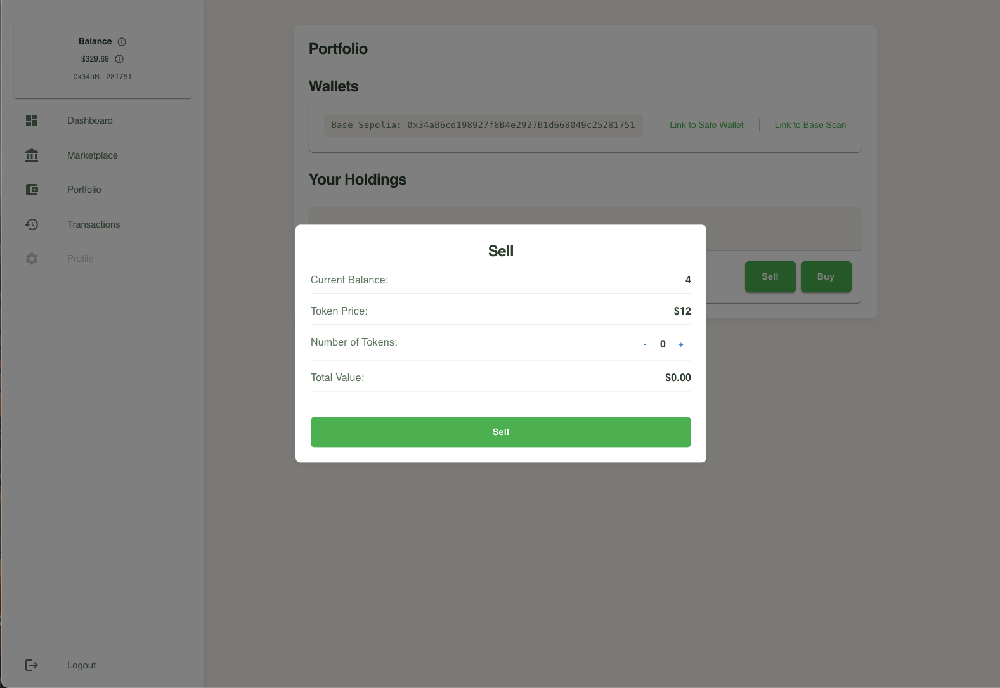
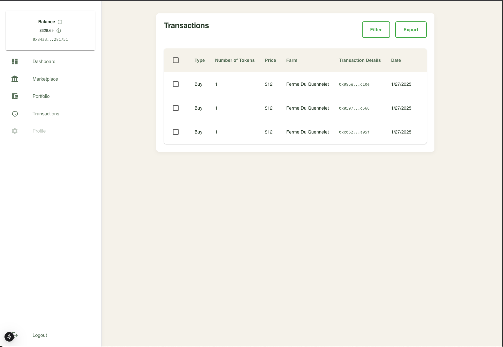
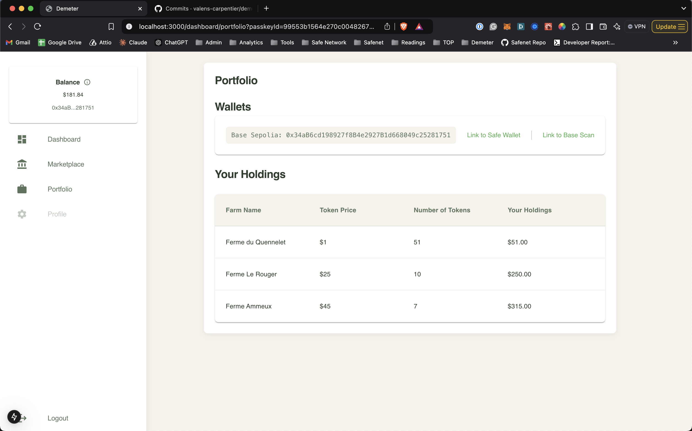

# Demeter

A decentralized platform for fractional farm ownership using tokenization, built on Base network and powered by Safe{Core} Protocol.

## Overview

Demeter allows users to purchase tokens representing fractional ownership of farms. The platform leverages Base network for low fees and fast transactions, while utilizing Safe's account abstraction.

## Screenshots

### Login with Passkeys

*Secure authentication using Safe Protocol's passkey integration*

### Dashboard Overview

*Main dashboard showing portfolio overview and available farms*

### Farm Token Marketplace

*Browse and purchase available farm tokens*

### Buy Farm Token

*Purchase farm tokens using your Safe Account*

### Sell Farm Token

*Sell farm tokens to other users*

### Transaction History

*View your transaction history*

### Portfolio Management

*Track your farm token holdings and investments*

## Key Features

- **Account Abstraction**: Passwordless authentication using ERC-4337 and passkeys
- **Safe Smart Accounts**: Each user gets a Safe smart account
- **Farm Token Trading**: Buy and sell farm tokens using crypto
- **Asset Dashboard**: Track farm token holdings and portfolio value

## Technical Stack

### Blockchain
- Network: Base (Ethereum L2)
- Smart Contracts: Solidity
  - ERC-20: Farm tokens
  - ERC-4337: Account abstraction
  - ERC-721: Farm NFTs (for whole farm representation)

### Infrastructure
- Safe{Core} Protocol
  - Account abstraction
  - Smart account management
  - Passkey authentication
  - Transaction Service API for history & queuing
- Infura: Node infrastructure
- Hardhat: Smart contract development and deployment

### Frontend
- Framework: Next.js
- Language: TypeScript
- UI: React

## Core features

1. **Authentication**
   - Passwordless login using passkeys
   - Safe smart account creation/recovery

2. **Asset Management**
   - View farm token portfolio
   - Track balance and holdings

3. **Trading**
   - Browse farm token marketplace
   - Purchase tokens
     - Via crypto
   - Sell tokens
     - To crypto

## Technical Implementation

### Smart Account Architecture
- Each user account is a Safe smart account
- All assets are stored in Safe vaults
- Account abstraction via ERC-4337
- USDC payment integration for token purchases
- Transaction history and queuing via Safe Transaction Service

### Safe Transaction Service Integration
- Transaction history tracking

### Integration Points
- Safe Passkey Authentication: [Safe Passkey Tutorial](https://docs.safe.global/advanced/passkeys/tutorials/react)

## MVP Scope
- Core trading functionality
- Safe account integration
- Basic portfolio management

## User Flow

### 1. Register with Safe Passkey
- As a user, I want to register to the platform using passkeys with Safe AA

### 2. Login with Passkeys
- As a user, I want to login to the platform using Safe AA passkeys

### 3. Marketplace
- As a user, I want to browse the marketplace to view available farm tokens for purchase

### 4. Purchase Farm Token
- As a user, I want to purchase a farm token to become a fractional owner of a farm

### 5. Portfolio
- As a user, I want to view my portfolio of farm tokens and track my investment
- As a user, I want to sell my farm token to other users - Not implemented yet

## Owner Flow (Admin) - Not implemented yet

### 1. Login with Safe Passkey
- As an owner, I want to login to the platform using Safe AA passkeys

### 2. Create Farm
- As an owner, I want to create a farm to tokenize my farm with a farm token 
- As an owner, I want to see all farms I generated

### 3. Manage Farm
- As an owner, I want to manage my farm and track my investment
- As an owner, I want to change the price of my farm token if needed

## Development Setup

### Environment Configuration
- Network: Base Sepolia Testnet
- RPC URL: https://sepolia.base.org
- Chain ID: 84532
- Safe Transaction Service API: https://safe-transaction-base-sepolia.safe.global/

### Deployed Contracts
- Farm Factory: 0x24829794aCA3e34a3300e66A25f42261b0203bfD
- Entry Point: 0x5FF137D4b0FDCD49DcA30c7CF57E578a026d2789

### Key Dependencies
- Material UI v6.1.7
- Safe Protocol Kit v4.1.0
- Safe Relay Kit v3.1.0
- Safe Transaction Service API
- Ethers.js v6
- Hardhat v2.22.18